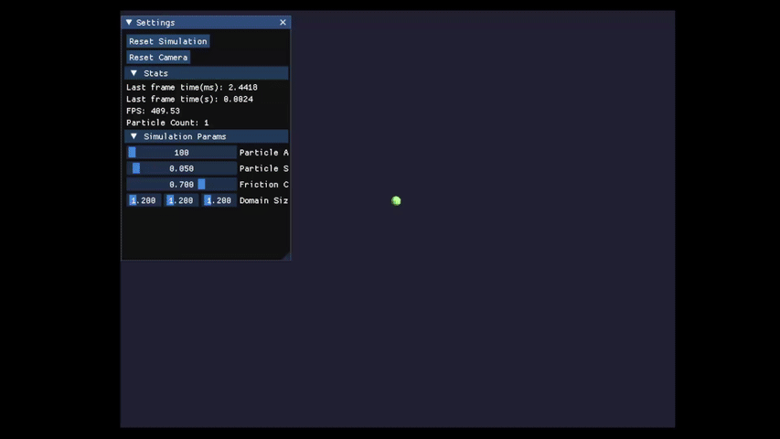

# ParticleFlow
Python particle simulation

ParticleFlow is a particle simulation engine built with Python and OpenGL. It offers and interactive environment to visualiase and experiment with particle dynamic, including collision detection, wall interactions and custimisable simulation parameters.

## Features
- **Real time simulation:** visualise the particles in 2D-3D space with real time updates.
- **Customisable Parameters:** adjust particle count, size, domain dimensions, and friction coefficients to experiment.
- **Collision Detection:** Efficient spatial partitioning for accurate particle based and particle wall collisions.
- **Interactive UI:** User interface built with ImGui for parameter adjustments and simulation control.
- **Modular Architecture:** Clean separation between core engine components and application-specific logic.
## Demo


## Installation
### Prerequisites
  - `Python 1.11.x` > **This version is required due to ImGui not being functional with latest Python**
  - `pip package manager`
### Clone Repository
```
git clone https://github.com/yourusername/ParticleFlow.git
cd ParticleFlow
```
### Create Python Environment
```
# 1. Create a virtual environment in the project folder
python3 -m venv .venv

# 2. Activate it
# on macOS/Linux:
source .venv/bin/activate

# on Windows (PowerShell):
.venv\Scripts\Activate.ps1
```

### Install Dependencies
```
pip install -r requirements.txt
```
### Running Application
```
python main.py
```

## Usage
### Controls
- `Left click + drag`: rotates camera around pivot
- `Right click + drag`: pan camera
- `Alt + left click`: zoom in and out
### Simulation Controls
- Adjust parameters such as particle count, size, and friction from the UI panel
- Reset the simulation or camera via the reset buttons at the top of the UI panel
> [!NOTE]
> The UI panel can be dragged by holding the blue top of the panel, or hidden by pressing the arrow on the top left. 